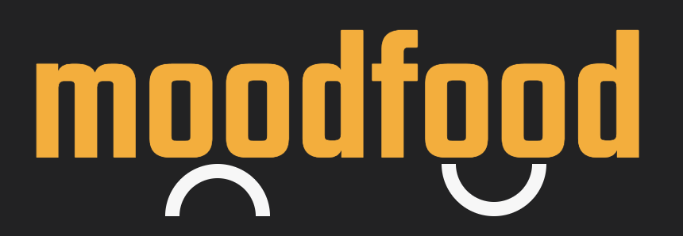

<div align="center">
  <a href="https://mood-food.herokuapp.com/#/">Live Site</a>
</div>

# Background and Overview
MoodFood is a minimum viable product that allows users to discover new restaurants that fit their mood. It will connect to Google Maps Api to find nearby restaurants according to the user's location. Gets to know the user from feedback and user's input and updates suggestions accordingly.

# Technologies Stack
* MongoDB
* NoSQL Database
* Javascript
* React/Redux
* Google Maps Javascript API

# Technologies and Challenges

## MongoDB and Express

We stored all user login information and the choices they make for each mood. When the user logs in, they are directed to a "How are you feeling today?" page, where the user selects a mood. Then based on their mood returns a restaurant.


## React, Redux, Node

moodFood pulls infromation from MongoDB and Google APIs to display the restaurant that matches the user's mood. For `Hangry` and `Adventurous` moods, the user doesn't decide the food of their choice. For `Hangry`, we return the restaurant that is closet to the user and for `Adventurous` we return the food choice which the user didn't pick.


## Styling 

We used SCSS throught the project for better CSS structuring and readability. 
### For each Mood
```javascript
.single-mood{

    display: flex;
    flex-wrap: wrap;
    width: 500px;
    margin: auto;
    padding: 20px;

    .Happy{
       background-color: $happy-light;
       color: $happy-dark;
    }
    a.Happy:hover{
         background-color: $happy-dark;
            color:$happy-light; 
    }


    .Stressed{
        background-color: $stress-light;
       color: $stress-dark;  
    }
    a.Stressed:hover{
         background-color: $stress-dark;
            color:$stress-light; 
    }

    .Sad{
        background-color: $sad-light;
        color: $sad-dark;
    }
    a.Sad:hover{
         background-color: $sad-dark;
            color:$sad-light; 
    }

    .Overwhelmed{
        background-color: $over-light;
        color: $over-dark;
    }
    a.Overwhelmed:hover{
         background-color: $over-dark;
            color:$over-light; 
    }

    .Hangry{
        background-color: $hangry-light;
        color: $hangry-dark;
    }
    a.Hangry:hover{
         background-color: $hangry-dark;
            color:$hangry-light; 
    }

    .Adventurous{
        background-color: $adv-light;
        color: $adv-dark;
    }

    a.Adventurous:hover{
         background-color: $adv-dark;
            color:$adv-light; 
    }
}
```
